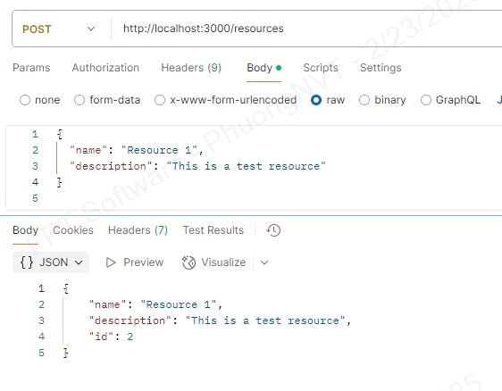
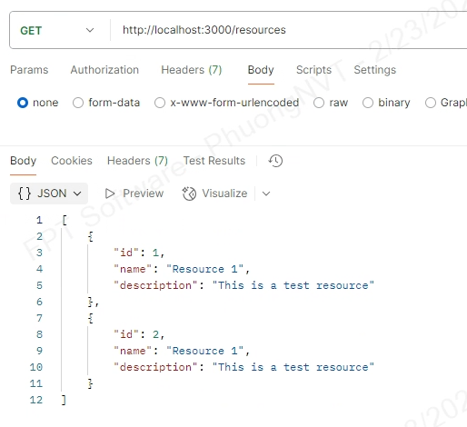
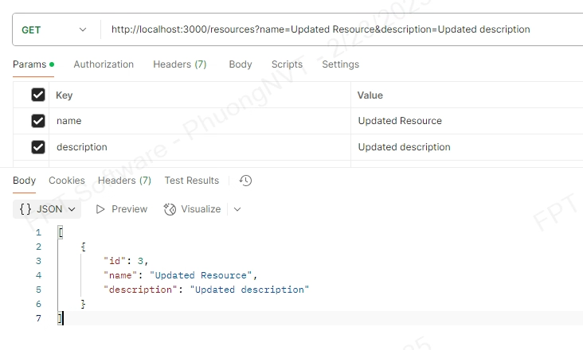
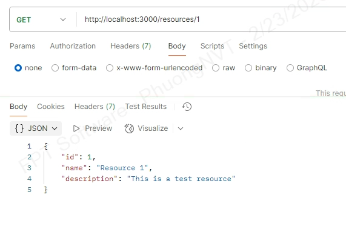
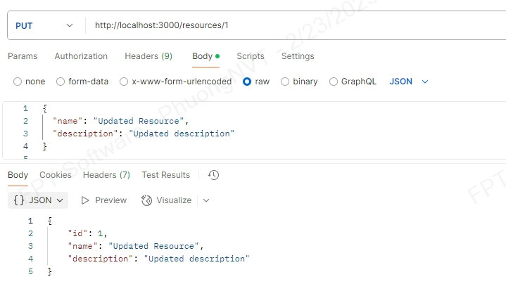
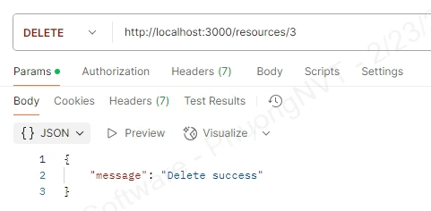

## 📌 Welcome to project of Thanh Phuong Overview


# 🚀 Setup environment 
```bash
Precondition:
1. Install nodejs
2. Install MySql latest
3. Setup database 
- Create database local.
- Create schema with name 'demo'(detail can see file database/data-source.ts).

```
# 🚀 Run the Project
```bash
# Install dependencies
npm install

# Build the project
npm run build


# Start the server
npm start
```

## 🔗 API Endpoints
| Method | Endpoint       | Description          |
|--------|---------------|----------------------|
| POST   | /resources    | Create a new resource |
| GET    | /resources    | List all resources or filter  |
| GET    | /resources/:id | Get a resource by ID |
| PUT    | /resources/:id | Update a resource |
| DELETE | /resources/:id | Delete a resource |


## 🔗 API Endpoints & Examples

### 1. Create a new resource
**POST** `/resources`
#### Example Request:
```bash
curl -X POST http://localhost:3000/resources \
  -H "Content-Type: application/json" \
  -d '{"name": "Resource 1", "description": "This is a test resource"}'
```


### 2. List all resources
**GET** `/resources`
#### Example Request:
```bash
curl -X GET http://localhost:3000/resources
or
curl -X GET http://localhost:3000/resources?name=Updated Resource&description=Updated description
```

or filter:


### 3. Get a resource by ID
**GET** `/resources/:id`
#### Example Request:
```bash
curl -X GET http://localhost:3000/resources/1
```

### 4. Update a resource
**PUT** `/resources/:id`
#### Example Request:
```bash
curl -X PUT http://localhost:3000/resources/1 \
  -H "Content-Type: application/json" \
  -d '{"name": "Updated Resource", "description": "Updated description"}'
```

### 5. Delete a resource
**DELETE** `/resources/:id`
#### Example Request:
```bash
curl -X DELETE http://localhost:3000/resources/1
```

## 🎉 Thank You
A huge thanks to **99TECH** for this opportunity! 🙌

## 📞 Contact
If you have any questions or issues, please reach out to **contact** My gmail **thanhphuongsw123@gmail.com** or telephone number **0359995977**.
