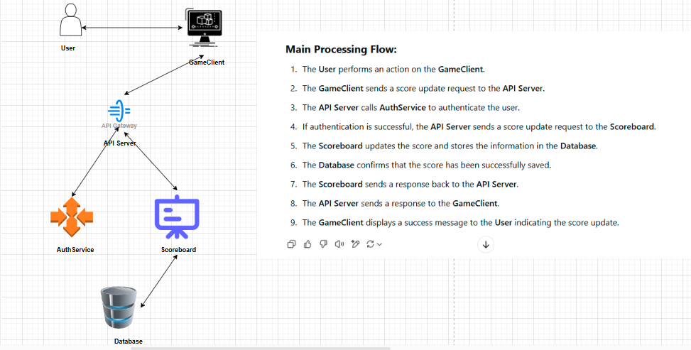

# 🏆 Scoreboard API Module

## 📖 Overview
This document provides the specification for the Scoreboard API module, which will be implemented by the backend engineering team. The module handles user score updates and retrieves the top 10 scores in real-time.

## 🔧 Software Requirements
- A website with a **scoreboard** displaying the **top 10 users' scores**.
- Scores should **update in real-time**.
- Users increase their scores by performing an **action** (the action itself is not relevant here).
- **Security must be enforced** to prevent unauthorized score manipulation.

---

## 🚀 API Specification

### 🔹 General API Rules
- All requests must include an **Authorization Token** in the request header.
- API responses are in **JSON format**.
- **Rate limiting** should be implemented to prevent abuse.
- All scores should be validated before processing.

---

### 1️⃣ **Update User Score**
- **📌 Endpoint:** `POST /api/score/update`
- **📖 Description:** Updates the user's score when an action is completed.
- **🛡️ Headers:**  
 ```http
  Authorization: Bearer <token>


  📩 Request Body:
{
  "user_id": "string",
  "score": "integer"
}

📤 Response:
{
  "message": "Score updated successfully",
  "new_score": "integer"
}
```
🔍 Validations:
- * Ensure user_id exists.
- * Validate that the score update request is legitimate.
- * Implement anti-fraud mechanisms to prevent fake score increases.
### 2️⃣ Get Top 10 Scores
- **📌 Endpoint:** `GET /api/score/top10`
- **📖 Description:** Retrieves the top 10 users with the highest scores.
- **🛡️ Headers:** 
 ```http
Authorization: Bearer <token>

📤 Response:
{
  "top_scores": [
    {"user_id": "string", "score": "integer"}
  ]
}
```
- **💾 Performance Optimizations:**
Use caching (Redis) to reduce database queries.
Implement pagination if needed for larger leaderboards.

### 3️⃣ Get User Score
- **📌 Endpoint:** `GET /api/score/user/{user_id}`
- **📖 Description:** Retrieves the score of a specific user.
- **🛡️ Headers:** 
 ```http
Authorization: Bearer <token>

📤 Response:
{
  "user_id": "string",
  "score": "integer",
   ...
}
```
🔍 Validations:
- * Ensure user_id exists.
- * Restrict access so users can only fetch their own scores (unless admin).
---
🔄 Execution Flow Diagram


---

## 🔐 Security Considerations
✅ Authentication & Authorization

- Use JWT-based authentication (Bearer <token>).
- Ensure only authorized users can update scores.
- Prevent users from viewing other users scores unless permitted.

✅ Data Validation & Integrity

- Reject invalid or negative scores.
- Prevent manual score manipulation (e.g., replay attacks).
- Verify that score updates are triggered by legitimate actions.

✅ Rate Limiting & Abuse Prevention

- Implement rate limiting (e.g., 100 requests per minute per user).
- Detect and block suspicious activities (e.g., a user trying to update scores rapidly).

✅ Data Privacy
---
- Ensure encrypted transmission (HTTPS) for all API requests.
- Do not expose sensitive user data in responses.
---
💡 Performance & Scalability Improvements
🚀 Caching Strategy

- Use Redis to cache top 10 scores and reduce database load.
- Implement cache invalidation when scores are updated.
---
🚀 Database Optimization

- Use indexes on user_id and score for faster lookups.
- Store frequently accessed data in NoSQL databases if needed.
---
🚀 Real-time Updates

- Consider using WebSockets or Server-Sent Events (SSE) to push score updates.
- Avoid frequent polling to reduce server load.
---
✅ Final Notes:

- The API should be secure, performant, and scalable.
- Future improvements may include event-driven architecture for score updates.
- Monitor API usage with logging and analytics to detect anomalies.
---
📌 This document will guide the backend engineering team in implementing a robust and secure Scoreboard API module. 🚀


